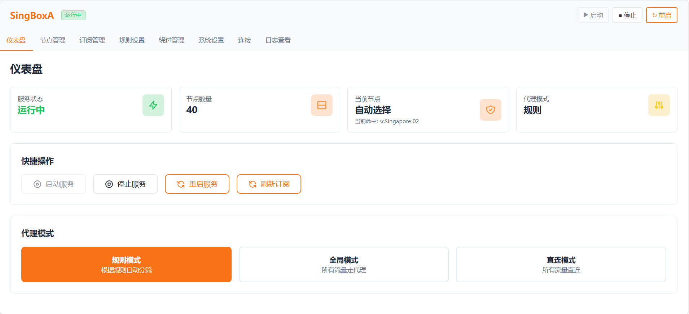

# SingBoxA

一个基于 [sing-box](https://github.com/SagerNet/sing-box) 的代理管理工具，提供 Web 管理界面，用于订阅管理、节点切换、测速、规则配置和运行状态查看。


## 功能简介

- Web 管理界面
- Clash 订阅导入与更新
- 节点切换与自动选择
- 节点测速与质量检测
- 规则模式 / 全局模式 / 直连模式
- DNS 缓存清理与运行状态查看


## 环境要求

- Linux
- root 权限
- Go `1.18.1+`（仅源码编译时需要）
- sing-box `1.13.7`

## Debian 安装包部署

适用于 Debian / Ubuntu 系统。

```bash
sudo dpkg -i singboxa_1.0.3_amd64.deb
sudo systemctl enable --now singboxA
```

安装完成后访问：

```text
http://localhost:3333
```

常用命令：

```bash
sudo systemctl status singboxA
sudo systemctl restart singboxA
sudo journalctl -u singboxA -f
```

卸载：

```bash
sudo dpkg -r singboxa
```

如需同时清理数据目录：

```bash
sudo rm -rf /var/lib/singboxA
```

## 源码部署

### 1. 安装 sing-box

```bash
bash <(curl -fsSL https://sing-box.app/deb-install.sh)
```

### 2. 获取源码

```bash
git clone https://github.com/dalei1563/singboxA.git
cd singboxA
```

### 3. 编译

```bash
go build -o singboxA .
```

### 4. 启动

```bash
sudo ./singboxA
```

启动后访问：

```text
http://localhost:3333
```

## 目录说明

默认数据目录：

```text
/var/lib/singboxA
```

主要文件：

```text
config.yaml
state.yaml
subscriptions/
singbox/config.json
singbox/cache.db
```
